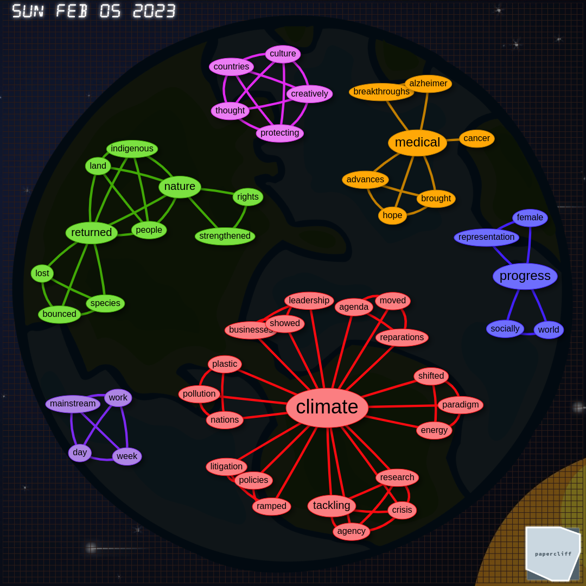

# Graph Vis

This project is a visualization tool that represents nodes and edges of a network on a canvas with an animated
background. Nodes are clustered by colors for better visual distinction.

The project utilizes the [vis.js](https://visjs.org/) library to accomplish network rendering,
[this](https://www.vecteezy.com/video/3316275-cartoon-background-space-ship-animation-paralax) video for the background,
and [this](https://codepen.io/UXauthority/pen/KzoBGZ) script to draw the "fabric of the universe".

## Usage

To use this project, crate a `single-day-actions.js` file and open the `image.html` file in a web browser.

The visualization starts with an empty canvas and dynamically adds nodes and edges based on actions. The actions are
contained in the `singleDayActions` object that should be defined in the `single-day-actions.js` file. Each action has
an `id`, `action` (either `add-node` or `add-edge`), `weight`, `source`, and `target`.

The `add-node` action adds a new node to the visualization with the color depending on its `cluster` property, and the
`add-edge` action adds a new edge between two nodes identified by `source` and `target` properties.
